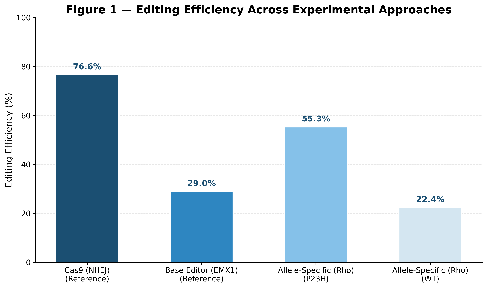
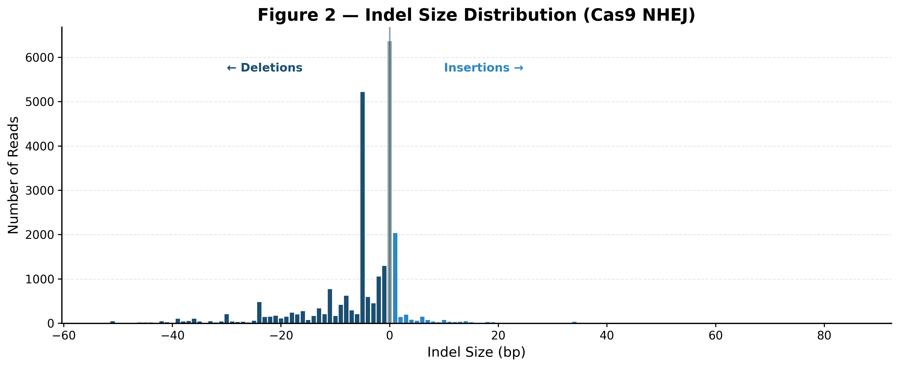
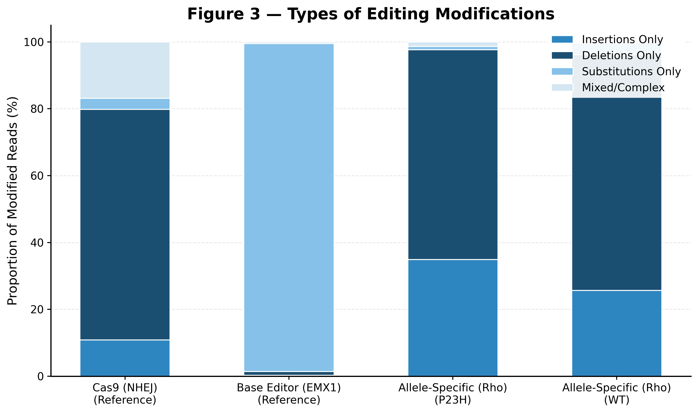
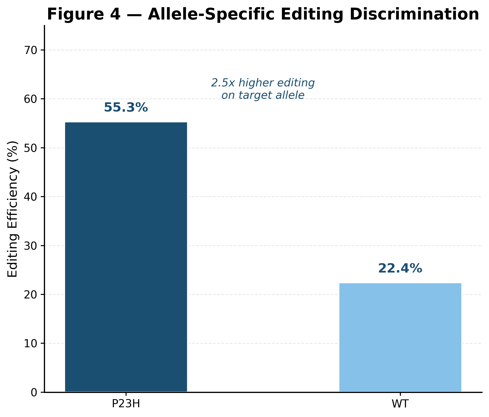
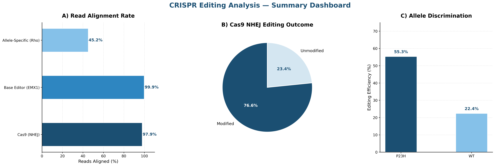

<h1 align="center">🧬 CRISPR Gene Editing Analysis Pipeline</h1>

<h3 align="center">Automated Amplicon Sequencing Analysis using Snakemake & CRISPResso2</h3>

<p align="center">
  
  
  
  
</p>

<p align="center"><i>An automated pipeline for quantifying CRISPR-Cas9 and base editor outcomes from amplicon sequencing data, comparing editing efficiency across multiple experimental approaches.</i></p>

---

## 📋 Table of Contents

- [Background](#background)
- [Overview](#overview)
- [Key Results](#key-results)
- [Figures](#figures)
- [Pipeline Architecture](#pipeline-architecture)
- [Repository Structure](#repository-structure)
- [Quick Start](#quick-start)
- [Tools Used](#tools-used)
- [Data Source](#data-source)
- [Methods](#methods)
- [Relevance to Therapeutic Gene Editing](#relevance-to-therapeutic-gene-editing)
- [References](#references)
- [Author](#author)

---

## 🔬 Background

CRISPR-Cas9 gene editing is advancing toward therapeutic applications, including LNP-delivered editing for cardiovascular disease (PCSK9, ANGPTL3) and blood disorders (sickle cell disease). A critical step in evaluating any gene editing approach is the quantification of editing outcomes from next-generation sequencing data — specifically, how efficiently the target site was edited and whether unintended modifications occurred.

This pipeline automates the analysis of amplicon sequencing data from CRISPR experiments, enabling reproducible quantification of editing outcomes across multiple experimental conditions.

---

## 🧪 Overview

This pipeline processes raw amplicon sequencing data from three CRISPR gene editing experiments:

| # | Experiment | Editing Tool | Description |
|---|---|---|---|
| 1 | **Cas9 NHEJ** | SpCas9 nuclease | Double-strand breaks repaired by NHEJ, creating indels |
| 2 | **Base Editor** | Adenine Base Editor | Precise A→G conversion at EMX1 locus without DSBs |
| 3 | **Allele-Specific** | SpCas9 | Preferential editing of P23H mutant vs wild-type Rho allele |

---

## 📊 Key Results

| Experiment | Target | Reads Aligned | Editing Efficiency | Key Finding |
|---|---|---|---|---|
| Cas9 NHEJ | Reference amplicon | 24,478 (97.9%) | **76.6%** | High efficiency with characteristic indel profile |
| Base Editor | EMX1 locus | 24,970 (99.9%) | **29.0%** | Precise A→G substitution with minimal indels |
| Allele-Specific | P23H mutant | 24,626 (98.5%) | **55.3%** | **2.5x preference** over wild-type allele (22.4%) |

### Biological Interpretation

- **Cas9 NHEJ (76.6%):** High editing rate with indel profile dominated by small deletions (1-10 bp), consistent with published Cas9 editing signatures
- **Base Editor (29.0%):** Lower apparent modification rate is expected — base editors make subtle single-nucleotide changes detected differently than large indels
- **Allele-Specific (2.5x discrimination):** Guide RNA shows clear preference for P23H mutant allele (55.3%) over wild-type (22.4%), which is therapeutically relevant for selective disease allele correction

---

## 📈 Figures

### Figure 1 — Editing Efficiency Across Experimental Approaches


### Figure 2 — Indel Size Distribution (Cas9 NHEJ)


### Figure 3 — Types of Editing Modifications


### Figure 4 — Allele-Specific Editing Discrimination


### Figure 5 — Summary Dashboard


---

## 🔧 Pipeline Architecture

```
Raw FASTQ files
      │
      ▼
[FastQC + MultiQC] ─── Quality control reports
      │
      ▼
[CRISPResso2] ─── Editing quantification per experiment
      │               • NHEJ: indel rates, size distribution
      │               • Base Editor: substitution frequencies
      │               • Allele-Specific: per-allele editing rates
      ▼
[Python Visualization] ─── 5 publication-quality figures
      │
      ▼
[Jupyter Notebook] ─── Detailed analysis report
```

All steps automated via **Snakemake** — full analysis runs with a single command.

---

## 📁 Repository Structure

```
crispr-off-target-pipeline/
│
├── README.md                          # Project overview (this file)
├── Snakefile                          # Automated pipeline definition
├── environment.yml                    # Reproducible conda environment
├── config/
│   └── config.yaml                    # Sample paths, amplicon sequences, parameters
│
├── data/
│   └── raw/                           # Input FASTQ files
│       ├── nhej.r1.fastq.gz           # Cas9 NHEJ paired-end read 1
│       ├── nhej.r2.fastq.gz           # Cas9 NHEJ paired-end read 2
│       ├── base_editor.fastq.gz       # Base editor single-end reads
│       └── allele_specific.fastq.gz   # Allele-specific single-end reads
│
├── results/
│   ├── qc/                            # FastQC and MultiQC reports
│   ├── crispresso/                    # CRISPResso2 output per experiment
│   │   ├── CRISPResso_on_nhej/
│   │   ├── CRISPResso_on_base_editor/
│   │   └── CRISPResso_on_allele_specific/
│   └── figures/                       # Publication-quality visualizations
│       ├── fig1_editing_efficiency.png
│       ├── fig2_indel_distribution.png
│       ├── fig3_modification_types.png
│       ├── fig4_allele_discrimination.png
│       └── fig5_summary_dashboard.png
│
├── scripts/
│   └── visualize_results.py           # Custom Python visualization code
│
├── notebooks/
│   └── analysis_report.ipynb          # Detailed Jupyter analysis report
│
└── docs/
    └── methods.md                     # Methods documentation
```

---

## 🚀 Quick Start

### Prerequisites
- Linux / macOS / WSL environment
- Conda or Miniconda installed

### 1. Clone the repository
```bash
git clone https://github.com/pri013/crispr-off-target-pipeline.git
cd crispr-off-target-pipeline
```

### 2. Create and activate the conda environment
```bash
conda env create -f environment.yml
conda activate crispr-offTarget
```

### 3. Run the full pipeline
```bash
snakemake --cores 4
```

### 4. View results
- **QC reports:** `results/qc/multiqc_report.html`
- **CRISPResso2 reports:** `results/crispresso/CRISPResso_on_*/CRISPResso2_report.html`
- **Figures:** `results/figures/`
- **Analysis notebook:** `notebooks/analysis_report.ipynb`

---

## 🛠 Tools Used

| Tool | Version | Purpose |
|---|---|---|
| FastQC | 0.12.1 | Per-read quality assessment and adapter detection |
| MultiQC | 1.14 | Aggregated QC reporting across all samples |
| CRISPResso2 | 2.2.9 | CRISPR editing outcome quantification and classification |
| Snakemake | 7.32.4 | Workflow management and pipeline automation |
| Python | 3.10 | Data analysis and visualization |
| matplotlib | 3.7.3 | Publication-quality figure generation |
| pandas | — | Data parsing and manipulation |
| samtools | 1.17 | Sequence alignment utilities |
| BWA | 0.7.17 | Burrows-Wheeler read alignment |

---

## 📦 Data Source

Example datasets from the CRISPResso2 project (Clement et al., 2019, *Nature Biotechnology*):

| Dataset | Type | Reads | Format | Description |
|---|---|---|---|---|
| nhej | Paired-end | 25,000 | FASTQ.gz | Cas9 nuclease editing experiment |
| base_editor | Single-end | 25,000 | FASTQ.gz | Adenine base editor at EMX1 locus |
| allele_specific | Single-end | 25,000 | FASTQ.gz | Allele-specific editing of Rho P23H/WT |

---

## 📝 Methods

### Quality Control
Raw reads were assessed using FastQC v0.12.1 with reports aggregated by MultiQC v1.14. All samples showed high base quality scores and no significant adapter contamination.

### Editing Quantification
CRISPResso2 v2.2.9 was used to align reads to reference amplicon sequences and quantify editing outcomes:
- **NHEJ experiment:** Paired-end reads merged and aligned to reference amplicon
- **Base editor experiment:** Quantification window set to 10 bp centered at -10 bp from guide sequence to capture expected ABE activity window
- **Allele-specific experiment:** Reads assigned to P23H or WT reference based on best alignment

### Visualization
Custom Python scripts using matplotlib generated publication-quality figures with a coordinated color palette for cross-experiment comparison.

### Automation
Complete workflow defined in a Snakefile with sample parameters stored in `config/config.yaml`, enabling reproducible single-command execution.

---

## 🎯 Relevance to Therapeutic Gene Editing

This pipeline demonstrates analytical capabilities directly applicable to evaluating therapeutic gene editing approaches:

- **On-target editing quantification** — Essential for evaluating editing efficiency of LNP-delivered CRISPR therapeutics
- **Cross-condition comparison** — Comparing different editing modalities mirrors real experimental workflows
- **Allele discrimination analysis** — Critical for therapeutic safety assessment
- **Automated workflows** — Scalable to high-throughput experiments with dozens of samples
- **Scientific communication** — Publication-quality figures for cross-functional stakeholder presentations

---

## 📚 References

1. Clement, K. et al. (2019). CRISPResso2 provides accurate and rapid genome editing sequence analysis. *Nature Biotechnology*, 37, 224-226.
2. Tsai, S.Q. et al. (2015). GUIDE-seq enables genome-wide profiling of off-target cleavage by CRISPR-Cas nucleases. *Nature Biotechnology*, 33, 187-197.
3. Rothgangl, T. et al. (2021). In vivo adenine base editing of PCSK9 in macaques reduces LDL cholesterol levels. *Nature Biotechnology*, 39, 949-957.

---

## 👤 Author

**Priya D** — Graduate Student, Bioinformatics

---


